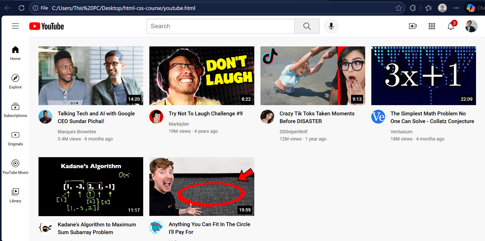

# 🎬 YouTube Homepage UI Clone (HTML & CSS)

A front-end **YouTube homepage interface clone** built using **HTML5 and CSS3**.  
This project recreates a real-world video streaming platform layout and demonstrates strong fundamentals in **modern CSS layout techniques**, **component structuring**, and **UI replication**.

---

## 🚀 Project Overview

This project replicates the visual structure of the YouTube homepage, focusing on layout accuracy and styling rather than backend functionality.

It includes:

- Header with search bar and navigation icons  
- Sidebar navigation menu  
- Video preview grid with thumbnails  
- Channel information and metadata layout  
- Hover tooltips and overlay UI elements  

The objective was to practice **production-style UI structuring** using only HTML and CSS, without frameworks or JavaScript.

---

## 🛠 Technologies Used

- **HTML5** – Semantic page structure  
- **CSS3** – Styling and layout design  
- **Flexbox** – Header alignment and navigation sections  
- **CSS Grid** – Video card layout system  

---

## 🎯 Key Learning Outcomes

- Structuring layouts similar to real-world platforms  
- Organizing CSS into reusable, component-based files  
- Mastering spacing, alignment, and positioning  
- Implementing hover interactions and micro-UI details  
- Designing scalable and maintainable front-end code  

---

## ✨ Features

✔ Structured, clean UI layout  
✔ Video grid built with CSS Grid  
✔ Sidebar navigation system  
✔ Functional search bar UI design  
✔ Hover tooltips and overlays  
✔ Separated CSS files by component  

---

## 📂 Project Structure

/icons
/styles
general.css
header.css
sidebar.css
video.css
/thumbnails
/channel-pictures
youtube.html

---

## 📸 Preview

---

## ⚠️ Disclaimer

This project is created **for educational and portfolio purposes only**.  
It is a visual UI clone and is not affiliated with or endorsed by YouTube.

---

## 👨‍💻 Author

**Virad Munir**  
Engineering Student | Frontend Enthusiast  

---

## 📄 License

This project is licensed under the **MIT License**.
